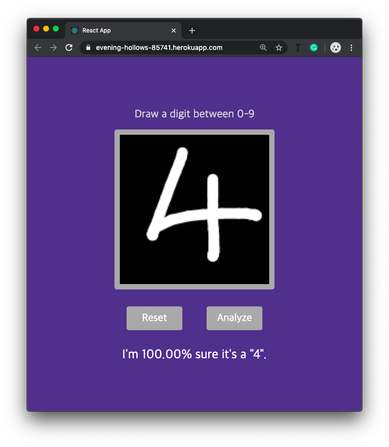

# Draw a digit

This app guesses the digit that you have written.

This repo is for the frontend application (uses p5.js and React).

This [app](https://evening-hollows-85741.herokuapp.com/) is hosted on heroku.

It may require some time to reboot the server on heroku if the heroku app was in sleep mode.

The backend (a Flask application) for this app is in this [repo](https://github.com/uoojin1/handwritten-digit-classifier-service).